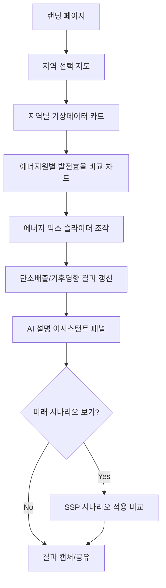
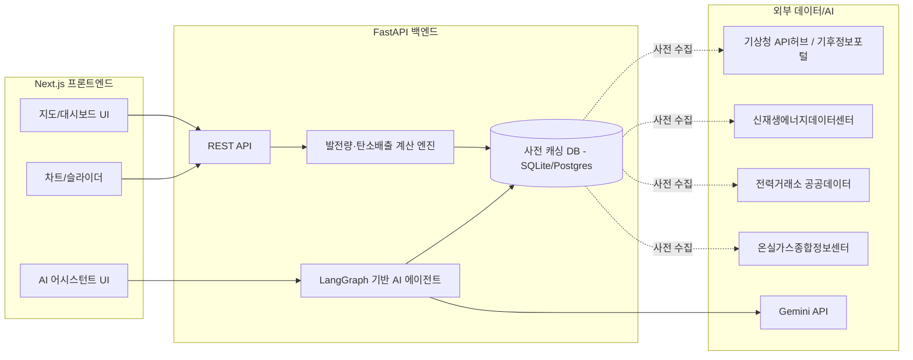

# ClimateLoop PRD
### 에너지가 만드는 기후, 기후가 바꾸는 에너지 — 체험형 기상·기후 교육 시뮬레이터

| 항목 | 내용 |
|---|---|
| 대상 공모전 | 기상·기후 AI 해커톤 경진대회 (한국생산성본부 주관) |
| 공모 주제 | AI 활용 체험·참여형 기상·기후 교육 콘텐츠 개발 |
| 제출형식 | 웹 기반 인터랙티브 콘텐츠/시뮬레이터 (구글폼 온라인 접수) |
| 문서 버전 | v0.1 (초안) |
| 작성일 | 2026-06-16 |

---

## 1. 개요

### 1.1 한 줄 요약
지역을 선택하면 실제 기상 데이터로 태양광·풍력·수력·화력의 발전 효율을 비교해주고, 사용자가 직접 에너지 믹스를 조정하면 그 선택이 탄소배출과 미래 기후에 미치는 영향을 실시간으로 보여주는 웹 시뮬레이터.

### 1.2 문제 정의
- 일반 시민은 "에너지 정책"과 "기후변화"를 별개의 이야기로 받아들이는 경우가 많고, 둘 사이의 인과관계를 체감할 기회가 적다.
- 기상 데이터(일사량, 풍속 등)와 에너지 발전 효율의 관계, 그리고 에너지 믹스와 탄소배출·기후변화의 관계는 각각 따로 보도되지만, 하나의 순환 구조로 연결해서 보여주는 콘텐츠는 드물다.
- 공공데이터(기상청, KIER, KPX, GIR 등)가 충분히 개방되어 있음에도, 일반인이 접근 가능한 형태로 가공·시각화된 사례는 적다.

### 1.3 목표
- 기상·기후 데이터와 에너지 데이터를 결합해, 사용자가 "조작 → 결과 확인 → 이해"하는 체험형 학습 경로를 제공한다.
- AI(물리 기반 추정 모델 + LLM 설명 에이전트)를 활용해 단순 통계 나열이 아닌, 사용자 맞춤 설명을 제공한다.
- 해커톤 본대회(8/21~22) 기준으로 2일 내 구현 가능한 MVP 범위를 명확히 정의한다.

---

## 2. 공모 요건 매핑

| 요건 | 대응 방안 |
|---|---|
| AI 활용 체험·참여형 기상·기후 교육 콘텐츠 | 기상 데이터 기반 발전효율 추정(물리/통계 모델) + LLM 설명 에이전트로 "AI 활용" 충족, 슬라이더·지도 조작으로 "체험·참여형" 충족 |
| 웹 기반 인터랙티브 콘텐츠/시뮬레이터 | Next.js 기반 SPA, 데스크톱 프로그램 형태 배제 |
| 기상·기후 주제 적합성 | 기상 관측 데이터, SSP 기후변화 시나리오를 핵심 입력값으로 사용 |
| 심사기관 적합성 (기상청 / 기후에너지환경부) | 기상청 어필: 관측 데이터 활용 정확도 / 환경부 어필: 에너지 정책·탄소배출 임팩트 |

---

## 3. 타겟 사용자

- **일반 시민·학생**: 자신의 지역이 어떤 에너지에 유리한지, 에너지 선택이 기후에 어떤 영향을 주는지 체험하며 학습
- **심사위원**: 기상 데이터 활용의 정확성과 AI 활용도, 그리고 발표 데모의 직관성을 평가

---

## 4. 핵심 컨셉

> "날씨가 에너지를 결정하고, 에너지 선택이 다시 기후를 바꾼다"

단방향(에너지 → 기후 영향)이 아니라, 기상 → 에너지 → 기후 → (장기적으로) 다시 기상에 영향을 주는 순환(loop) 구조로 설계한다. 4개 모듈로 구성한다.

| 모듈 | 이름 | 핵심 질문 | 데이터 방향 |
|---|---|---|---|
| Module 1 | 지역 에너지 적합도 | 내 지역은 어떤 에너지가 유리할까? | 기상 → 에너지 |
| Module 2 | 에너지 믹스 임팩트 | 내가 고른 에너지 조합이 기후에 미치는 영향은? | 에너지 → 기후 |
| Module 3 | AI 설명 어시스턴트 | 왜 이런 결과가 나왔을까? | 결과 → 설명 |
| Module 4 (확장) | 미래 기후 시나리오 | 2050년엔 이 지역 에너지 효율이 어떻게 바뀔까? | 기후변화 → 에너지 (장기) |

---

## 5. 주요 기능 명세

| 기능 | 설명 | 우선순위 | 사용 데이터 |
|---|---|---|---|
| 지역 선택 지도 | 시/도 단위 클릭 시 해당 지역 패널 표출 | Must | 행정구역 경계 데이터 |
| 기상 데이터 카드 | 연평균 일사량, 평균 풍속, 강수량, 기온 표시 | Must | 기상청 API허브 / 기상자료개방포털 |
| 에너지원별 발전효율 비교 차트 | 태양광/풍력/수력/화력 추정 발전량(정규화 점수) 바 차트 | Must | 신재생에너지 자원지도 + 물리 모델 |
| 에너지 믹스 슬라이더 | 화력/원자력/재생에너지 비율 조정 UI | Must | KPX 발전원별 발전량(현재 비율 기본값) |
| 탄소배출 실시간 계산 | 믹스 변경 시 추정 배출량(tCO2eq) 갱신 | Must | GIR 온실가스 인벤토리 / 배출계수 |
| AI 설명 어시스턴트 | 결과에 대한 자연어 설명 + Q&A | Must | LLM(Gemini API) + 위 계산 결과 |
| 미래 시나리오 토글 (SSP1-2.6 vs SSP5-8.5) | 2050년 기준 기상 조건 변화 적용 | Should | 기후정보포털 SSP 시나리오 |
| 결과 공유/캡처 | 결과 화면 이미지 저장 | Could | - |
| 시/군/구 단위 확장 | 더 세밀한 지역 단위 | Could | 고해상도 격자 데이터 |

---

## 6. 사용자 플로우

---

## 7. 데이터 요구사항

| 카테고리 | 데이터명 | 제공기관 | 형식/해상도 | 활용 방식 | 비고 |
|---|---|---|---|---|---|
| 기상 관측 | 지상관측자료 (기온·강수량·풍속·일사량 등) | 기상청 API허브 (apihub.kma.go.kr) | 시간/일 단위, 지점별 | 발전효율 계산 입력값 | 회원가입 후 API키 발급, 12개 분야 데이터 제공 |
| 기상 관측 | 과거 기후통계 | 기상자료개방포털 (data.kma.go.kr) | 일/월/연 단위 | 지역별 평균값 산출 | 대용량 다운로드 가능 |
| 기상 예보 | 단기예보 조회서비스 (초단기실황/단기예보) | 공공데이터포털 | 5km 격자, 1~3시간 단위 | 실시간 모드용 예보 | 활용신청 후 약 1일 승인 소요 |
| 신재생 자원 | 태양광/풍력 자원지도 | 신재생에너지데이터센터(KIER, kier-solar.org) / 공공데이터포털 | 태양광 500m, 풍력 100m~1km 격자 | 지역별 발전 잠재량 시각화 | 풍력은 AI 기반 풍황연산모델로 생산 |
| 신재생 자원 | 풍력기상자원지도 | 기상자료개방포털(data.kma.go.kr) | 100m 격자 | 풍력 잠재량 데이터 보강/교차검증 | 국립기상과학원 제공, 최근 5년(2016.7~2021.6) 평균 |
| 신재생 설비 현황 | 전국 태양광발전소 전기사업허가정보 | 공공데이터포털 | 위경도, 설비용량, 가동상태 등 | 실제 설치 현황 오버레이 | 매월 초 전국 단위 병합 |
| 발전/전력 | 발전원별 발전량(계통기준), 발전설비용량 | 한국전력거래소(KPX) 공공데이터포털 API | 시간/비정기 단위 | 현재 에너지 믹스 기본값 | 개발계정 트래픽 제한(일 100건), 활용사례 등록 시 증량 가능 |
| 발전/전력 | 현재/오늘 전력수급현황조회 | 한국전력거래소(KPX) | 실시간 | 실시간 수급 비교 | openapi.kpx.or.kr 병행 |
| 발전/전력 | 행정구역별 에너지사용량 통합데이터 | KPX·한전·지역난방공사·도시가스협회 결합 | 행정구역 단위, 연 1회 갱신 | 지역별 에너지 소비 패턴 | |
| 기후변화 시나리오 | SSP/RCP 기후변화 전망정보 | 기후정보포털 (climate.go.kr) | ASOS 95개 지점 + 유역 단위 | Module 4 입력값 | 시군구 단위 보고서 다운로드 가능 |
| 기후변화 시나리오 | 1km 격자 한반도 기후변화 시나리오 | 농촌진흥청 농업날씨365 | 1km 격자, 시군구 단위 | 세밀한 지역 단위 시나리오 보강 | 기상청 국가표준시나리오 인증 |
| 탄소배출 | 국가 온실가스 인벤토리, 발전원별 배출계수 | 온실가스종합정보센터(GIR), EG-TIPS(tips.energy.or.kr) | 연 단위, 부문별 | 에너지 믹스 변화 → 배출량 계산 | 정확한 배출계수는 공식자료 직접 확인 (추정치 임의 생성 금지) |

> **데이터 확보 우선순위**: 해커톤 본대회 전까지 기상청 API허브, KIER 자원지도, KPX 발전원별 발전량, GIR 배출계수 4종을 사전에 받아 로컬 DB에 캐싱해두는 것을 권장. 실시간 API 호출은 데모 안정성을 위해 보조 수단으로만 사용.

### 7.1 즉시 사용 가능한 글로벌 오픈데이터셋 (가입·승인 불필요)

한국 공공데이터 API는 대부분 가입 후 활용신청 → 승인 절차가 필요하다. 승인 지연에 대한 안전장치, 또는 "한국 vs 해외" 비교 기능이 필요하다면 아래 데이터셋은 가입 없이 즉시 다운로드/호출이 가능하다.

| 데이터셋 | 제공기관 | 형식/해상도 | 활용 방식 |
|---|---|---|---|
| NASA POWER | NASA | 전 세계, 일/시간 단위, API 또는 CSV | 일사량·기상 데이터 즉시 호출, 승인 전 임시 대체용 |
| Global Solar Atlas | World Bank / DTU | 전 세계 250m 격자, GeoTIFF | 태양광 잠재량 글로벌 비교, KIER 자원지도와 교차검증 |
| Global Wind Atlas | World Bank / DTU | 전 세계 250m 격자, 10~200m 고도별 | 풍력 잠재량 글로벌 비교, ERA5 기반 |
| Our World in Data – CO2 & Energy Dataset | OWID (GitHub: owid/co2-data) | 국가별 연 단위 CSV | 국가별 에너지 믹스·탄소배출 비교, 배출계수 벤치마크 |

> 글로벌 데이터셋은 전국 평균치나 해외 비교용으로 적합하고, 한국 지역 단위의 세밀한 분석은 기상청·KIER·KPX 데이터가 더 정확하다. 두 데이터군을 함께 쓰면 한국 데이터 승인이 늦어져도 데모가 끊기지 않는 안전장치가 된다.

---

## 8. 시스템 아키텍처

- **프론트엔드**: Next.js + Tailwind, 지도는 Leaflet 또는 Mapbox, 차트는 Recharts
- **백엔드**: FastAPI 단일 서비스로 계산 엔진과 AI 에이전트를 분리된 라우터로 구성
- **AI 에이전트**: LangGraph로 "계산 결과 → 자연어 설명" 파이프라인 구성 (BabyCry 프로젝트의 챗봇 아키텍처 재사용 가능)
- **데이터 계층**: 해커톤 규모를 고려해 SQLite로 시작, 필요 시 Postgres로 전환

---

## 9. 핵심 계산 로직 개요

### 9.1 태양광 발전량 추정
- 입력: 지역 일사량(kWh/m²/day), 패널 면적, 모듈 효율, 성능비(performance ratio)
- 공식 개념: `발전량 = 일사량 × 패널면적 × 모듈효율 × 성능비`
- 참고: SolarShield 프로젝트의 태양 고도각 계산 로직을 일사량 보정에 재활용 가능

### 9.2 풍력 발전량 추정
- 입력: 평균 풍속, 터빈 스윕면적, 공기밀도, 파워커브(절단풍속 포함)
- 공식 개념: `발전량 = 0.5 × 공기밀도 × 스윕면적 × 풍속³ × 출력계수` (정격용량 상한 적용)

### 9.3 탄소배출/기후영향 추정
- 입력: 에너지 믹스 비율 × 각 에너지원 배출계수(GIR/EG-TIPS 공식 수치)
- 출력: 추정 tCO2eq, 동일 발전량 대비 화력 100% 시나리오와의 비교값

### 9.4 AI 설명 에이전트 동작
- 계산 결과(수치)를 LangGraph 노드에 전달 → Gemini API가 자연어 해설 생성 → 사용자 추가 질문 시 같은 컨텍스트로 후속 응답

---

## 10. MVP 범위 (해커톤 2일 기준)

| 구분 | 항목 |
|---|---|
| Must | 지역 선택, 기상데이터 카드, 발전효율 비교 차트, 에너지 믹스 슬라이더, 탄소배출 계산, AI 설명(기본 응답) |
| Should | AI 어시스턴트 Q&A(자유 질문), 결과 비교(현재 vs 다른 지역) |
| Could | SSP 시나리오 모드, 결과 공유, 시군구 단위 확장 |
| Won't (이번 라운드 제외) | 회원가입/로그인, 다국어 지원, 모바일 네이티브 앱 |

---

## 11. 일정 매핑

| 공모 일정 | 기간 | 해야 할 일 |
|---|---|---|
| 접수 | 6.8 ~ 7.3 18:00 | 기획서/PRD 확정, 핵심 데이터 사전 신청(공공데이터포털 활용신청) |
| 서류심사·발표 | 7.6 ~ 7.17 | 발표용 목업/와이어프레임 준비 |
| 해커톤 본대회 | 8.21 ~ 8.22 | MVP(Must 항목) 구현, 데이터 캐싱, 데모 시나리오 리허설 |
| 결과 공개 | 9월 2주 | - |

---

## 12. 차별화 포인트 및 기대효과

- 기상 → 에너지 → 기후의 순환 구조를 하나의 인터랙션 흐름으로 연결한 점이 단순 통계 대시보드와의 차별점
- 실제 공공데이터(기상청, KIER, KPX, GIR)를 그대로 연동해 "교육 콘텐츠"이면서도 신뢰도 있는 수치 기반
- AI 설명 에이전트로 단순 시각화를 넘어 "왜 그런지"까지 답변, 교육적 효과 강화

---

## 13. 리스크 및 고려사항

- **데이터 신청 지연**: 공공데이터포털 API는 승인까지 최소 1일 소요되므로 접수 초기에 미리 신청
- **트래픽 제한**: KPX 개발계정은 일 100건 제한 → 핵심 데이터는 사전 다운로드 후 로컬 캐싱
- **수치 정확성**: 탄소배출계수 등은 GIR/EG-TIPS 공식 발표 자료의 수치를 그대로 사용하고, 임의 추정치를 사실처럼 표기하지 않음
- **데모 안정성**: 해커톤 현장 네트워크 이슈에 대비해 실시간 API 호출보다 사전 캐싱 데이터를 기본값으로 사용

---

## 14. 참고 데이터 출처 링크

- 기상청 API허브: https://apihub.kma.go.kr
- 기상자료개방포털: https://data.kma.go.kr
- 기후정보포털: https://www.climate.go.kr
- 신재생에너지데이터센터(KIER): https://kier-solar.org
- 공공데이터포털: https://www.data.go.kr
- 한국전력거래소 실시간 전력수급: https://new.kpx.or.kr
- 온실가스종합정보센터(GIR): https://www.gir.go.kr
- EG-TIPS 에너지온실가스 종합정보 플랫폼: https://tips.energy.or.kr
- NASA POWER: https://power.larc.nasa.gov
- Global Solar Atlas: https://globalsolaratlas.info
- Global Wind Atlas: https://globalwindatlas.info
- Our World in Data CO2 & Energy Dataset: https://github.com/owid/co2-data