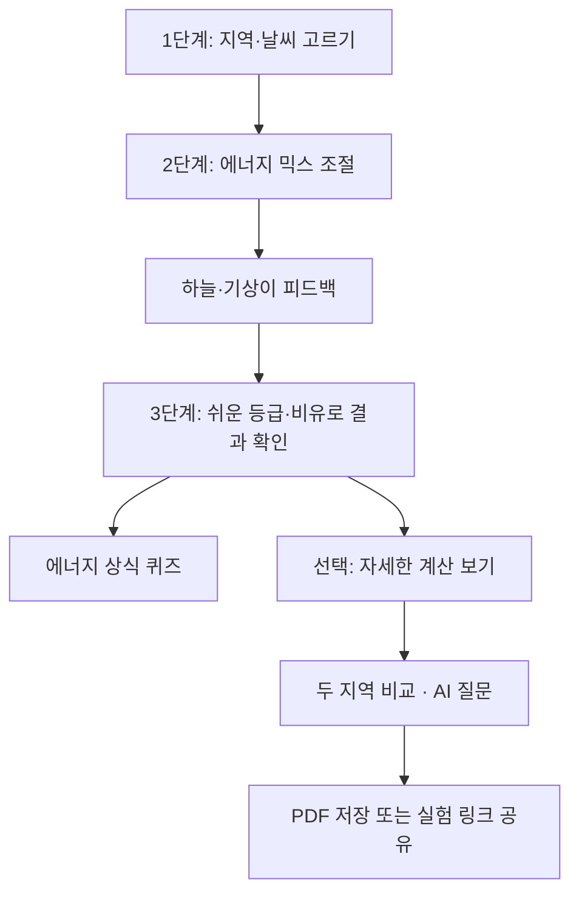
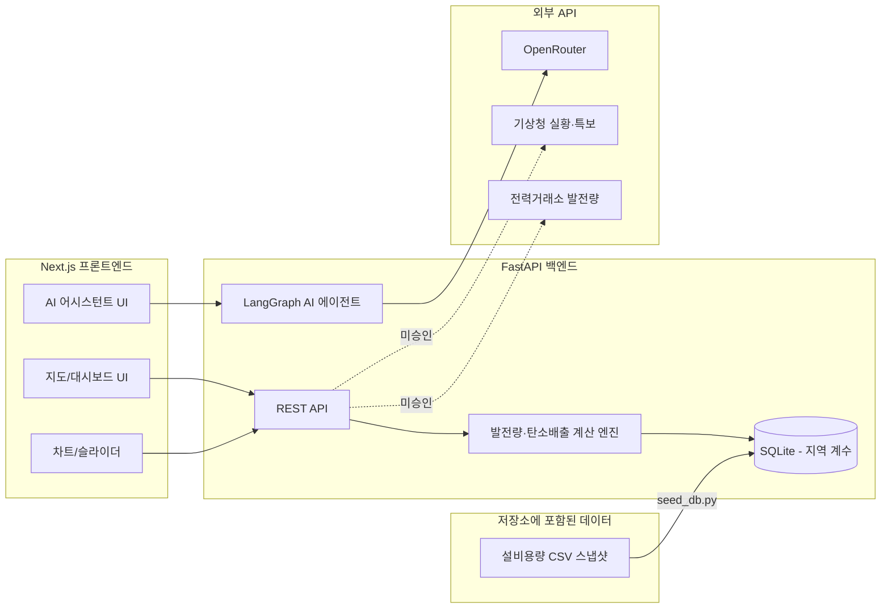

# ClimateLoop
### 에너지가 만드는 기후, 기후가 바꾸는 에너지 — 체험형 인터랙티브 기후 및 에너지 시뮬레이터

> ## 📄 라이선스 — 받아 쓰기 전에 읽어 주세요
>
> **본 프로젝트의 코드는 [MIT 라이선스](LICENSE)입니다** (상업적 이용을 포함해 자유롭게
> 사용·수정·재배포할 수 있습니다).
>
> **단, 기상이 마스코트 이미지(`frontend/public/images/gisangi-hello.png`)는 별도 조건이
> 적용됩니다** — 기상청 저작물이며 **출처표시 + 상업적 이용금지**(공공누리 제2유형과
> 같은 조건)입니다. 공공 교육 목적의 비영리 활용은 출처를 표시하는 한 자유롭지만,
> **상업적으로 활용하려면 이 이미지를 제거하거나 별도 허가를 받아야 합니다.**
>
> 자세한 내용은 **[LICENSE-ASSETS.md](LICENSE-ASSETS.md)** 를 참고하세요.
> 서드파티 의존성 고지는 **[THIRD_PARTY_NOTICES.md](THIRD_PARTY_NOTICES.md)** 에 있습니다
> (react-leaflet 은 Hippocratic-2.1 로 MIT 가 아닙니다).
>
> 설치·실행은 **[README_SETUP.md](README_SETUP.md)** 를 보세요. 새로 clone 한 뒤
> **시드 단계를 건너뛰면 모든 지역의 결과가 똑같이 나옵니다.**

ClimateLoop은 **날씨와 에너지 선택이 서로를 어떻게 바꾸는지 직접 조작해 보는 웹
시뮬레이터**입니다. 지역과 기상 조건을 고르고 에너지 믹스 슬라이더를 움직이면,
그 선택이 탄소 배출량·전력망 안정성·지속가능성 점수에 어떤 영향을 주는지 즉시
다시 계산해 보여줍니다. 학교 수업이나 공공 전시에서 쓸 수 있도록 만들었습니다.

**목차**

| 장 | 내용 |
|---|---|
| [1. 개요](#1-개요) | 빠른 시작, 무엇을 할 수 있는지, 구현 현황 |
| [2. 프로젝트 배경](#2-프로젝트-배경) | 왜 만들었는지 |
| [3. 누구를 위한 것인가](#3-누구를-위한-것인가) | 사용자와 활용 맥락 |
| [4. 핵심 컨셉](#4-핵심-컨셉) | 기상 → 에너지 → 기후의 순환 구조 |
| [5. 기능 목록](#5-기능-목록) | 화면 기능과 연동 상태 |
| [6. 사용자 흐름](#6-사용자-흐름) | 화면을 어떤 순서로 쓰는가 |
| [7. 데이터](#7-데이터) | 지금 쓰는 데이터와 확장 후보 |
| [8. 시스템 구조](#8-시스템-구조) | 프론트·백엔드·외부 연동 |
| [9. 계산 로직](#9-계산-로직) | 값이 어떻게 나오는지, 그 한계 |
| [10. 설계 원칙](#10-설계-원칙) | 이 프로젝트가 지키려 한 것 |
| [11. 알려진 한계](#11-알려진-한계) | 그대로 믿으면 안 되는 것 |
| [12. 참고 자료](#12-참고-자료) | 데이터 출처 링크 |
| [13. 기여 방법](#13-기여-방법) | 개발 참여 안내 |
| [14. 문의](#14-문의) | 연락 방법 |
| [15. 구동 환경](#15-구동-환경) · [16. 배포](#16-배포) · [17. 서드파티 자원 및 라이선스](#17-서드파티-자원-및-라이선스) | 운영 정보 |

---

## 1. 개요

### 1.0 빠른 시작

> 공개 저장소: [github.com/toto6343/climateloop](https://github.com/toto6343/climateloop)

```bash
git clone https://github.com/toto6343/climateloop.git && cd climateloop

# 백엔드
cd backend && python -m venv venv && source venv/bin/activate   # Windows: .\venv\Scripts\activate
pip install -r requirements.txt && cp .env.example .env
python -m models.database                       # 테이블 생성 — backend/ 에서
cd .. && python backend/scripts/seed_db.py      # 지역 계수 적재 — 저장소 루트에서
cd backend && uvicorn main:app --reload         # :8000

# 프론트엔드 (새 터미널)
cd frontend && npm ci && cp .env.example .env.local && npm run dev   # :3000
```

http://localhost:3000 을 엽니다. **API 키는 없어도 됩니다** — AI 해설만 계산 결과 기반
문구로 대체되고 나머지 기능은 모두 동작합니다.

> `python -m models.database` 를 건너뛰면 다음 줄이 `no such table` 로 실패합니다. 서버를
> 띄우는 것으로는 테이블이 생기지 않습니다. 줄마다 작업 디렉터리가 다른 것도 의도된
> 것입니다 — 이유와 문제 해결은 **[README_SETUP.md](README_SETUP.md)** 에 정리했습니다.

### 1.1 무엇을 할 수 있는가

1. **지역을 고른다** — 17개 시·도 중 하나. 지도와 발전원 구성 차트가 함께 바뀝니다.
2. **기상 조건을 고른다** — 맑음 / 장마·폭우 / 태풍·강풍 / 한파·겨울 4종.
3. **에너지 믹스를 조정한다** — 재생에너지·원자력·화석연료 비율을 슬라이더로 움직입니다.
4. **결과가 즉시 바뀐다** — 발전원별 적합도, 탄소 배출강도, 전력망 안정성, 지속가능성
   점수, 그리고 "다음에 무엇을 바꾸면 좋은지" 추천이 함께 갱신됩니다.
5. **왜 그런지 묻는다** — AI 어시스턴트가 지금 화면의 계산 결과를 근거로 해설하고
   자유 질문에 답합니다.
6. **결과를 저장·공유한다** — PDF 리포트로 내려받거나 현재 실험 조건을 URL로 복사합니다.

> "즉시 다시 계산한다"는 것은 조작할 때마다 백엔드가 값을 새로 계산해 화면에 반영한다는
> 뜻입니다. 기상청 실시간 관측을 매번 불러온다는 의미가 아닙니다([1.4](#14-구현-현황) 참고).

### 1.2 왜 이런 것이 필요한가

- 에너지 정책과 기후변화는 뉴스에서 따로 다뤄지고, 둘 사이의 인과를 **직접 만져 보며**
  확인할 기회는 드뭅니다.
- 일사량·풍속 같은 기상 조건이 발전 효율을 좌우한다는 사실과, 에너지 믹스가 탄소 배출을
  좌우한다는 사실은 각각 알려져 있지만, 이 둘을 **하나의 순환**으로 이어 보여주는 교육
  콘텐츠는 많지 않습니다.
- 공공데이터는 충분히 개방되어 있는데도 일반인이 바로 만져 볼 수 있는 형태로 가공된
  사례는 적습니다.

### 1.3 무엇을 목표로 했는가

- **조작 → 결과 확인 → 이해**의 순서로 배우는 체험형 학습 경로를 만든다.
- 계산은 규칙 기반으로 **재현 가능하게** 하고, 설명만 LLM에 맡긴다.
  - 현재 구현에서 "AI"에 해당하는 것은 **해설과 채팅뿐**입니다. 점수·적합도·추천은 전부
    결정론적 계산입니다([9장](#9-계산-로직) 참고).
- **수치의 성격을 숨기지 않는다.** 출처가 불확실한 계수는 화면·PDF·API 응답에 그 사실을
  함께 적습니다([10장](#10-설계-원칙) 참고).

### 1.4 구현 현황

**기준일: 2026-09-11.** 이 표가 실제 동작 범위에 대한 단일 기준입니다.

#### ✅ 구현 완료

| 기능 | 설명 |
|---|---|
| 지역 선택 | **드롭다운 하나**로 17개 시·도를 고릅니다. 지도와 발전원 구성 원형 차트는 고른 지역을 보여주는 표시 전용이며, 선택 상태 하나에서 함께 파생되므로 언제나 같이 갱신됩니다 |
| 초보자 학습 Wizard | 기본 화면은 **1단계 지역·날씨 선택 → 2단계 에너지 믹스 조절 → 3단계 결과·퀴즈** 순서로 진행됩니다. 전문 차트·계산 근거는 `자세한 계산 보기`에서 선택적으로 열 수 있습니다 |
| 교사용 수업 모드 | 상단의 모자 아이콘으로 목표 점수를 입력하면 현재 조건을 담은 `mode=teacher` 수업 링크를 복사합니다. 로그인·학생 개인정보·서버 저장 없이 같은 조건을 공유할 수 있습니다 |
| 지역 표시 지도 | Leaflet 기반. 마커 크기는 그 지역의 **추정 발전량(MWh)** 에 비례하고, 고른 지역은 진한 원·링·상시 라벨로 강조됩니다. 발전량은 관측값이 아닌 추정 시뮬레이션값입니다([9.3.2](#932-지역별-추정-발전량과-그-한계-중요) 참고) |
| 발전원별 적합도 차트 | 태양광·풍력·수력·화력 상대 점수 바. **지역 계수 × 기상 배수 × 현재 믹스 비중**으로 계산되므로 슬라이더를 바꾸면 값도 함께 변합니다(수력은 믹스·기상과 무관한 고정 지수). 지역 고유의 잠재량 지표가 아닙니다 |
| 적합 발전원 요약 + 근거 토글 | "이 지역에 가장 적합한 발전원"을 결론부터 한 줄로 적고, 토글 안에서 계산식을 항 단위로 펼칩니다(예: `화석연료 33% × 서울 화력 설비 집중도 0.87 = 29.1`). 4개 카드에도 항목별 토글이 붙습니다. 식의 재료는 백엔드가 내려주므로 화면이 적합도를 다시 계산하지 않습니다 |
| 에너지 믹스 슬라이더 | 3축 조정, 합계 100% 자동 재분배. 슬라이더와 점수가 같은 카드에 처음부터 함께 보입니다 — 모달도, 스크롤 점프도, 펼쳐야 나오는 아코디언도 없습니다 |
| 초보자용 결과 해석 | 점수를 `아주 좋아요 / 좋아요 / 조금 아쉬워요 / 도전 중` 등급으로 먼저 보여주고, 탄소 수치는 나무·자동차에 빗댄 학습용 문장으로 설명합니다. 전문 단위는 상세 화면에서 확인합니다 |
| 시각 피드백·마스코트 안내 | 믹스 결과에 따라 하늘·햇빛·구름 장면과 기상이의 표정·말풍선이 바뀝니다. 캐릭터 이미지는 기상청 저작물 조건에 따라 출처를 표시합니다 |
| 학습 배지 | 지역 탐험, 믹스 조절, 목표 달성 행동을 브라우저에 익명으로 저장하고 배지로 표시합니다. `처음부터`를 누르면 초기화됩니다 |
| 접근성 지원 | Wizard 영역 이름, 단계 상태, 슬라이더 음성 값, 라이브 결과 안내, 키보드 포커스, `prefers-reduced-motion`을 지원합니다 |
| 기상 시나리오 선택 | 맑음 / 장마·폭우 / 태풍·강풍 / 한파·겨울 4종 |
| 탄소 배출 계산 | **실제 발전 구성** × 배출계수 가중평균. 기상 배수가 재생 발전량을 깎으면 인도 전력에서 화력 비중이 올라가 배출강도도 함께 오릅니다 — 기상을 바꾸면 배출량도 바뀝니다(계수는 예시값, [9.3.1](#931-적용-배출계수와-그-한계-중요) 참고) |
| 전력망 안정성 판정 | 공급/수요 비교 → 부족·안정·과잉 3단계 |
| 지속가능성 지수 | 탄소 0.55 + 전력망 0.30 + 지역 적합 0.15 복합 지표 |
| **학습 동기 설계 (ARCS Confidence)** | 목표 진행률, 4단계 레벨, 점수 요인 분해, 다음 행동 추천 + 원클릭 적용 |
| 배출 시뮬레이션 차트 | 입력을 하나씩만 움직여 본 두 그래프. ① 믹스 고정 · 기상 4종 배출량 비교 ② 기상 고정 · 재생에너지 +10/20/30%p 시 배출량 변화 |
| **기상 관측 참고 카드** | 선택 지역의 기온·풍속·강수량·특보를 표시합니다. 기상청 실황·특보가 모두 성공한 경우에만 실측 배지와 원자료를 보여주며, 그 외에는 내장 시나리오 사용 상태를 명시합니다 |
| 에너지 상식 퀴즈 | 발전원별 기초 상식 한 문제. 화면의 계산 결과와 무관한 배경 지식을 다룹니다 |
| AI 설명 어시스턴트 | LangGraph + OpenRouter 자연어 해설(조작이 멎으면 자동 생성) + 자유 질문 채팅. 응답이 LLM 생성인지 폴백인지 배지로 구분합니다 |
| PDF 리포트 | 시뮬레이션 결과를 브라우저에서 PDF로 저장합니다. 본문은 화면을 그대로 캡처하므로 한글이 그대로 나오고, 별도 폰트를 번들하지 않습니다 |
| 오류 처리 | 백엔드 장애·설정 누락 시 원인 안내 배너, AI 장애 시 결정론적 폴백 |
| 데이터 출처 구분 표기 | 같은 화면에 실측과 추정값이 섞이지 않도록 각 API가 `data_source`(`"live"`/`"fallback"`)를 내려주고, 화면 각주와 배지가 이 값으로 갈립니다. 확신이 없으면 항상 `fallback` 쪽입니다. 화면 최하단 "데이터 출처" 아코디언이 7개 출처를 상태별로 정리해 보여줍니다 |
| 운영 상태·재현 메타데이터 | `GET /health`는 프로세스 생존을, `GET /ready`는 DB·계수·설정 준비 상태를 확인합니다. `/calculate`와 기상 응답에는 API·모델·프로필 버전과 생성·관측 시각이 포함됩니다 |
| 지역 계수의 공표 데이터 연동 | 17개 시·도 × 4개 발전원 = 68개 계수를 **공표 설비용량에서 유도**합니다(화력은 한국전력거래소, 태양광·풍력·수력은 한국에너지공단). 두 자료는 저장소에 CSV 스냅샷으로 함께 배포됩니다([9.3.1](#931-적용-배출계수와-그-한계-중요) 참고) |

#### ⚠️ 제한 사항 · 향후 계획

| 기능 | 현재 상태 |
|---|---|
| **기상 데이터 카드** (현재·연평균 기온·풍속·강수량·특보) | **화면 구현.** 현재 실황은 기상청 실황·특보가 모두 성공한 경우에만 표시하고, 연평균 요약은 NASA POWER 일별 자료를 적재한 지역에서 표시합니다. 데이터가 없으면 추정값을 만들지 않고 미사용 상태를 알립니다 |
| 두 지역 나란히 비교 | **구현.** 같은 기상·에너지 믹스 조건에서 두 지역의 지속가능성·배출강도·전력망·적합 발전원을 비교합니다. 백엔드 `POST /compare`를 사용합니다 |
| 미래 기후 시나리오 (SSP) 모드 | 미구현 |
| 시·군·구 단위 확장 | 미구현 |
| 공표 배출계수 연동 | 미구현. 배출계수는 여전히 코드 상수(`EMISSION_FACTORS`)인 예시값입니다 — [9.3.1](#931-적용-배출계수와-그-한계-중요)의 교체 계획을 따릅니다 |
| **기상청 실황·특보 연동** | 호출부와 캐싱은 구현되어 있습니다(`GET /api/weather/scenario`). 실황(`getUltraSrtNcst`)과 특보(`getWthrWrnList`)를 조합해 4종 중 하나를 **추천**하고 화면에 참고 배지를 띄우는 구조이며, 판별 순서는 태풍·강풍 특보 → 강수 → 기온≤0 → 맑음입니다. **다만 특보 서비스가 활용신청 미승인이라 현재 배지가 표시되지 않습니다** — 두 호출이 모두 성공해야 판정하기 때문입니다(반쪽짜리 근거로 "기상청 실시간"을 주장하지 않습니다). 승인되면 코드 수정 없이 동작합니다. 추천값이 사용자의 탭 선택을 덮어쓰는 일은 없습니다 |
| **기상청 실황·특보 연동** | 호출부와 캐싱은 구현되어 있습니다(`GET /api/weather/scenario`). 실황(`getUltraSrtNcst`)과 특보(`getWthrWrnList`)를 조합해 4종 중 하나를 **추천**하고 화면에 참고 배지를 띄우는 구조이며, 관측 기준시각과 오래된 데이터 여부도 함께 표시합니다. **다만 특보 서비스가 활용신청 미승인이라 현재 배지가 표시되지 않을 수 있습니다** — 두 호출이 모두 성공해야 판정하기 때문입니다. 추천값이 사용자의 탭 선택을 덮어쓰는 일은 없습니다 |
| 한국전력거래소 발전원별 발전량 현황(GW) | 호출부는 있으나 **활용신청 미승인이라 미반영.** 발전원 구성 도넛의 구성비가 추정값으로 유지됩니다. 승인되어도 MWh 절대 크기와 지역별 배분은 추정값입니다([9.3.2](#932-지역별-추정-발전량과-그-한계-중요) 참고) |
| 한국전력거래소 전력시장 발전설비 정보 (실시간 API) | **검토했으나 채택하지 않았습니다** — 이 API의 지역 구분이 수도권·비수도권·제주 3분할이라 17개 시·도 계수를 만들 수 없습니다. 같은 기관 자료를 시·도 단위로 받는 길이 위의 EPSIS 설비용량 스냅샷입니다 |

#### ⚪ 이번 범위에서 의도적으로 제외한 것

"아직 못 만든 것"이 아니라 **만들지 않기로 한 것**입니다. 교육 시뮬레이터로서 필요하지
않다고 판단해 처음부터 범위 밖에 두었습니다.

| 항목 | 제외한 이유 |
|---|---|
| 회원가입 · 로그인 | 학습 결과를 서버에 남길 이유가 없습니다. 개인정보를 받지 않으면 지켜야 할 것도 줄어듭니다 |
| 다국어 지원 | 국내 지역 데이터와 한국어 해설이 대상이라 번역만으로는 의미가 완결되지 않습니다 |
| 모바일 네이티브 앱 | 수업·전시에서 링크 하나로 열리는 것이 더 중요합니다. 웹 화면은 375px 폭까지 대응합니다 |

#### ⚠️ 수치의 성격

배출계수와 기준 발전 규모는 **공식 통계가 아니라 상대 비교용 예시값**입니다. 지도에
표시되는 **지역별 발전량(MWh)도 관측값이 아니라 추정 시뮬레이션값**입니다. 근거와 교체
방법은 [9.3.1](#931-적용-배출계수와-그-한계-중요)·[9.3.2](#932-지역별-추정-발전량과-그-한계-중요)에
정리했습니다.

지역 계수는 공표 설비용량에서 유도하지만 **"그 지역에 설비가 얼마나 모여 있는가"(공급)**
를 재는 값이며, 자원 잠재력이나 전력 수요가 아닙니다.

면책 표기가 실제로 들어가 있는 위치:

| 위치 | 배출계수 면책 | 지역 계수 출처 표기 |
|---|---|---|
| 화면(각주·툴팁·근거 토글) | ✅ | ✅ 발전원별로 출처를 갈라 표기 |
| PDF 리포트 | ✅ | ❌ (미표기) |
| `GET /confidence/levels` | ✅ (`emission_factors.note` / `.source`) | ❌ (해당 필드 없음) |
| `POST /calculate` | ✅ 응답 `meta`와 화면 각주에서 확인 | ✅ (`data_source` / `data_source_detail.covered_sources`) |
| `POST /regions` | — (배출계수 미사용) | ✅ (`unit` = "MWh (추정)" / `note` / `scale` / `data_source`) |
| `GET /api/weather/scenario` | — | ✅ (`source` = `"live"`/`"fallback"`, `meta.observed_at`, `meta.stale`) |

---

## 2. 프로젝트 배경

이 프로젝트는 **기상·기후 AI 해커톤 경진대회**(한국생산성본부 주관, 2026)에 "AI 활용
체험·참여형 기상·기후 교육 콘텐츠" 주제로 출품하기 위해 시작됐습니다.

출발점이 된 문제의식은 하나였습니다 — **기상 조건이 발전 효율을 바꾸고, 그 결과인
에너지 믹스가 다시 기후를 바꾼다는 순환을 조작해 볼 수 있는 콘텐츠가 없다는 것.**
통계를 나열하는 대시보드는 있어도, 사용자가 값을 움직여 인과를 체감하는 형태는
드물었습니다.

대회 이후에는 **공개 교육 목적의 오픈소스**로 정리했습니다. 수업이나 전시에서 그대로
쓰거나, 지역·계수·데이터를 바꿔 다시 만드는 것을 염두에 두고 구조와 문서를 다듬었습니다.

---

## 3. 누구를 위한 것인가

- **학생·일반 시민** — 내 지역이 어떤 발전원에 유리한지, 에너지 선택이 기후에 어떤 영향을
  주는지 직접 만져 보며 확인합니다. 사전 지식이 없어도 됩니다.
- **교육자** — 수업이나 전시에서 화면을 띄워 쓰거나 슬라이더 조작을 과제로 낼 수 있습니다.
  화면의 모든 숫자에 계산 근거 토글이 붙어 있어 "왜 이 값인가"를 함께 짚을 수 있습니다.
- **개발자·연구자** — 계수와 데이터 출처를 갈아끼우기 쉽게 만들어 두었습니다. 배출계수는
  딕셔너리 한 곳, 지역 계수는 CSV 두 개가 단일 지점입니다([13장](#13-기여-방법) 참고).

수치의 절대 정확도를 주장하지 않습니다. 무엇이 실측이고 무엇이 예시값인지는
[1.4](#14-구현-현황)와 [11장](#11-알려진-한계)에 명시했습니다.

---

## 4. 핵심 컨셉

> "날씨가 에너지를 결정하고, 에너지 선택이 다시 기후를 바꾼다"

단방향(에너지 → 기후 영향)이 아니라, 기상 → 에너지 → 기후 → (장기적으로) 다시 기상으로
돌아오는 **순환(loop)** 구조로 설계했습니다. 이름의 "Loop"가 그것입니다.

| 모듈 | 이름 | 핵심 질문 | 데이터 방향 | 상태 |
|---|---|---|---|---|
| 1 | 지역 에너지 적합도 | 내 지역은 어떤 에너지가 유리할까? | 기상 → 에너지 | ✅ |
| 2 | 에너지 믹스 임팩트 | 내가 고른 조합이 기후에 미치는 영향은? | 에너지 → 기후 | ✅ |
| 3 | AI 설명 어시스턴트 | 왜 이런 결과가 나왔을까? | 결과 → 설명 | ✅ |
| 4 | 미래 기후 시나리오 | 2050년엔 이 지역 효율이 어떻게 바뀔까? | 기후변화 → 에너지 | ❌ 미구현 |

---

## 5. 기능 목록

각 기능이 실제로 어떤 데이터를 쓰는지 함께 적었습니다. 구현 여부의 단일 기준은
[1.4](#14-구현-현황)입니다.

| 기능 | 설명 | 연동 상태 |
|---|---|---|
| 초보자 학습 Wizard | 지역·날씨 선택 → 에너지 믹스 조절 → 결과·퀴즈의 3단계 화면 | ✅ 기본 진입 화면 |
| 지역 선택 | 초보자 화면의 큰 선택 상자 또는 상세 화면의 드롭다운으로 시·도를 고르면 지도 강조 + 발전원 구성 패널이 갱신됩니다 | ✅ 내장 좌표 |
| 발전원별 적합도 차트 | 태양광·풍력·수력·화력 상대 점수 바 | ✅ 공표 설비용량 기반 지역 계수 |
| 에너지 믹스 슬라이더 | 재생·원자력·화석 비율 조정 | ✅ 사용자 입력 |
| 탄소 배출 즉시 재계산 | 믹스·기상 변경 시 배출강도(gCO₂/kWh) 갱신 | ⚠️ 배출계수는 예시값 |
| AI 설명 어시스턴트 | 결과 자연어 해설 + 자유 질문 | ✅ OpenRouter |
| 지역별 추정 발전량 지도 | 마커 크기로 지역 간 규모 비교 | ⚠️ 추정 시뮬레이션값 |
| 에너지 상식 퀴즈 | 발전원별 기초 상식 문제 | ✅ 내장 문제 은행 |
| 결과 저장·공유 | PDF 리포트 다운로드 및 현재 조건 URL 복사 | ✅ 브라우저에서 생성·공유 |
| 두 지역 비교 | 같은 조건의 점수·배출·전력망·적합 발전원 비교 | ✅ `POST /compare` |
| 기상 데이터 카드 | 현재 기상청 실황·특보와 NASA POWER 일별 자료의 연평균 기온·풍속·강수량·일사량 집계 | ✅ `scripts/fetch_weather_data.py` 수집 → 검토 → `scripts/import_weather_data.py` 적재 |
| 미래 시나리오 토글 (SSP) | 2050년 기상 조건 적용 | ❌ 미구현 |
| 시·군·구 단위 확장 | 더 세밀한 지역 단위 | ❌ 미구현 |

---

## 6. 사용자 흐름



기본 화면은 초보자가 한 번에 하나의 질문에 집중하도록 세 단계로 나뉩니다. 전문 수치·차트·
계산 근거는 `자세한 계산 보기`에서 열 수 있습니다. 각 단계의 이전·다음 버튼으로 되돌아갈
수 있고, 상세 화면에서는 기존의 지도·적합도·배출 시뮬레이션·AI 설명을 모두 사용할 수 있습니다.

---

## 7. 데이터

### 7.1 지금 실제로 쓰는 것

| 용도 | 출처 | 형태 | 기준연도 |
|---|---|---|---|
| 화력 지역 계수 | 한국전력거래소 EPSIS 지역별 발전설비 설비용량 | 저장소 커밋 CSV | 2025 |
| 태양광·풍력·수력 지역 계수 | 한국에너지공단 기초지자체별 신재생에너지 보급 현황 | 저장소 커밋 CSV | 2024 |
| AI 해설·채팅 | OpenRouter | 런타임 API | — |

두 CSV는 공공데이터포털에서 **"이용허락범위 제한 없음"** 으로 공개된 자료이며 저장소에
함께 배포됩니다. 배출계수·기상 배수·기준 발전 규모는 외부 데이터가 아니라 내장 예시값입니다.
연동 상태 전체는 [15.2](#152-데이터api-출처)에 표로 정리했습니다.

### 7.2 확장 후보

아직 연동하지 않은 데이터셋입니다. 기여를 생각하고 있다면 출발점이 될 수 있습니다.

| 카테고리 | 데이터명 | 제공기관 | 형식/해상도 | 쓸 수 있는 곳 |
|---|---|---|---|---|
| 기상 관측 | 일별 기온·강수·풍속·일사량 | NASA POWER Daily API | 일 단위, 17개 대표 지점 | 연평균 기상 카드, 물리 기반 발전량 추정([9.5](#95-향후-확장-물리-기반-추정)) |
| 기상 관측 후보 | 지상관측자료 (기온·강수·풍속·일사량) | 기상청 API허브 | 시간/일 단위, 지점별 | NASA POWER 교차검증 및 향후 교체 후보 |
| 기상 관측 | 과거 기후통계 | 기상자료개방포털 | 일/월/연 단위 | 지역별 평균값 산출 |
| 신재생 자원 | 태양광·풍력 자원지도 | 신재생에너지데이터센터(KIER) | 태양광 500m, 풍력 100m~1km 격자 | 자원 잠재력 기반 계수(현재 계수는 설비 기준) |
| 신재생 자원 | 풍력기상자원지도 | 기상자료개방포털 | 100m 격자, netCDF | 풍력 잠재량 교차검증 |
| 신재생 설비 | 전국 태양광발전소 전기사업허가정보 | 공공데이터포털 | 위경도·설비용량 | 실제 설치 현황 오버레이 |
| 발전/전력 | 발전원별 발전량, 발전설비용량 | 한국전력거래소 | 시간/비정기 | 도넛 구성비 실데이터화 |
| 기후 시나리오 | SSP/RCP 기후변화 전망 | 기후정보포털 | ASOS 95개 지점 + 유역 | 모듈 4(미래 시나리오) |
| 기후 시나리오 | 1km 격자 한반도 기후변화 시나리오 | 농촌진흥청 농업날씨365 | 1km 격자, 시군구 | 세밀한 지역 단위 |
| 탄소배출 | 발전원별 배출계수 | 온실가스종합정보센터(GIR), EG-TIPS | 연 단위, 부문별 | `EMISSION_FACTORS` 교체([9.3.1](#931-적용-배출계수와-그-한계-중요)) |

> 국내 공공데이터 API 는 대부분 **활용신청 후 승인**이 필요합니다(보통 1일, 서비스별로 따로
> 신청해야 합니다). 승인 상태에 따라 화면 표기가 달라지므로, 연동을 추가할 때는 실패 경로와
> 각주 문구를 함께 손봐야 합니다([13장](#13-기여-방법) 참고).

### 7.3 지역 확장 시 참고할 수 있는 오픈데이터

가입·승인 없이 바로 내려받거나 호출할 수 있는 데이터셋입니다. 국내 지역 단위 정밀도는
7.2의 국내 자료가 더 높지만, **다른 나라·전 지구 범위로 확장하거나 국내 값을 교차검증할 때**
쓸 수 있습니다.

| 데이터셋 | 제공기관 | 형식/해상도 | 쓸 수 있는 곳 |
|---|---|---|---|
| NASA POWER | NASA | 전 세계, 일/시간 단위, API·CSV | 일사량·기상 데이터 |
| Global Solar Atlas | World Bank / DTU | 전 세계 250m 격자, GeoTIFF | 태양광 잠재량 국제 비교 |
| Global Wind Atlas | World Bank / DTU | 전 세계 250m 격자, 고도별 | 풍력 잠재량 국제 비교 |
| Our World in Data – CO2 & Energy | OWID | 국가별 연 단위 CSV | 국가 간 에너지 믹스·배출 비교, 배출계수 벤치마크 |

---

## 8. 시스템 구조



실선은 실제로 동작하는 경로, 점선은 호출부가 있으나 활용신청 미승인으로 폴백하는
경로입니다.

### 8.1 초보자 화면 구조

기본 진입 화면은 데이터 대시보드가 아니라 짧은 학습 활동으로 구성됩니다.

| 단계 | 사용자가 보는 것 | 숨겨진 전문 정보 |
|---|---|---|
| 1단계 | 지역 선택, 날씨 선택, 기상이의 안내 | 지역 계수, 지도, 적합도 계산식 |
| 2단계 | 큰 에너지 믹스 슬라이더, 비율, 변화하는 하늘 장면 | gCO₂/kWh, 공급·수요 원시 수치 |
| 3단계 | 지구 건강 점수, 쉬운 등급, 탄소 비유, 상식 퀴즈 | 요인별 감점, 시나리오 차트, 계산 근거 |

`자세한 계산 보기`를 누르면 기존 상세 분석 화면이 열립니다. 따라서 교육자나 개발자는
전체 근거를 확인할 수 있고, 초보 학습자는 처음부터 전문 용어를 읽지 않아도 됩니다.

- **프론트엔드**: Next.js + Tailwind CSS, 지도는 Leaflet, 차트는 Recharts
- **백엔드**: FastAPI 단일 서비스. 계산 엔진과 AI 에이전트를 분리된 모듈로 둡니다
- **AI 에이전트**: LangGraph StateGraph 두 개 — 요약(`agent.py`)과 대화(`chat.py`). 둘 다
  *컨텍스트 구성 → LLM 호출 → 후처리* 로 흐르고, 같은 공용 헬퍼로 같은 모델을 부릅니다
- **데이터 계층**: SQLite. 지역 계수 68개를 담으며 `seed_db.py` 가 CSV에서 적재합니다.
  규모가 커지면 Postgres로 옮길 수 있는 구조지만 현재 필요하지 않습니다

---

## 9. 계산 로직

이 장은 **화면의 숫자가 어떻게 나오는지, 그리고 어디까지 믿을 수 있는지**를 적습니다.
값을 바꾸거나 데이터를 갈아끼우려면 여기서 시작하세요.

### 9.0 현재 구현된 추정 방식 ✅

물리 모델 대신, 지역·기상·믹스의 **상대 관계를 표현하는 무차원 지수의 곱셈**으로 계산합니다.

```
태양광 적합도 = 재생에너지 비중(%) × 지역 solar 계수 × 기상 solar 배수   (100 상한)
풍력 적합도   = 재생에너지 비중(%) × 지역 wind 계수  × 기상 wind 배수    (100 상한)
수력 적합도   = 45 × 지역 hydro 계수                 (믹스·기상과 무관한 고정 지수)
화력 적합도   = 화력 비중(%) × 지역 thermal 계수
공급          = (태양광 적합도 + 풍력 적합도) / 2 + 원자력 비중 + 화력 비중
수요          = 100 × 기상 demand 배수
```

가정과 한계:

- 위 값은 **무차원 상대 지수**이며 kW·kWh 같은 물리량이 아닙니다. 절대 발전량을 주장하지
  않습니다.
- 적합도 4종 중 **태양광·풍력·화력은 현재 에너지 믹스에 연동**되고 **수력만 고정**입니다.
  따라서 이 차트는 "지역 고유의 잠재량"이 아니라 "지금 고른 믹스가 이 지역·이 기상에서
  얼마나 실현되는가"를 나타냅니다.
- 공급 식에서 재생에너지를 2로 나눈 것은 간헐성을 거칠게 반영한 **설계 선택**이며 특정
  문헌에서 유도한 계수가 아닙니다.
- 수력은 적합도 바에는 있으나 **공급 합계에는 포함되지 않습니다.**
- 식의 재료(지역 계수 4종, 기준값 1.0, 수력 기준 지수 45)는 `/calculate` 응답의
  `suitability_basis` 로 함께 내려갑니다. 화면의 근거 토글이 계산 과정을 그대로 펼치기
  위한 것이며, 적합도 값 자체는 여전히 백엔드가 한 곳에서만 계산합니다.

> 절 번호가 9.0 에서 9.3 으로 건너뜁니다. 태양광·풍력의 물리 기반 발전량 공식이 9.1·9.2 에
> 있었는데, 구현되지 않은 계획이라 확장 안내인 [9.5](#95-향후-확장-물리-기반-추정) 로
> 옮겼습니다. 9.3 이하는 문서 안팎에서 참조되는 번호라 그대로 두었습니다.

### 9.3 탄소배출/기후영향 추정 ✅ 구현
- 입력: 에너지 믹스 비율 + 기상 배수(기후 시나리오) + 지역 효율계수 × 발전원별 배출계수
- 공식:

  ```
  실제 발전량(재생)   = (믹스_재생 × 지역태양광계수 × 태양광배수
                        + 믹스_재생 × 지역풍력계수 × 풍력배수) / 2
  실제 발전량(원자력) = 믹스_원자력      # 급전 가능 전원 — 기상 무관
  실제 발전량(화력)   = 믹스_화력        # 급전 가능 전원 — 기상 무관

  배출집약도(gCO2/kWh) = Σ(실제 발전량ᵢ × 배출계수ᵢ) / Σ(실제 발전량ᵢ)
  ```

- **기상이 배출량에 반영되는 이유**: 단위가 gCO₂/kWh, 즉 *실제로 인도된 1kWh당* 배출량입니다.
  태풍이면 풍력이 멈추고(배수 0) 태양광도 10%만 남으므로 계획한 재생 비중이 그만큼 전력을
  만들어내지 못하고, 인도 전력에서 화력이 차지하는 비중이 올라가 1kWh당 배출량도 함께 오릅니다.
  분모가 되는 실제 발전량 합계는 전력망 판정(공급량)이 쓰는 값과 **같은 벡터**입니다 —
  배출량과 전력망 안정성이 하나의 발전 구성에서 나옵니다.
- 가중평균이므로 결과는 항상 계수 범위(12~650) 안에 있어 점수 환산 정의역이 유지됩니다.
- 출력: 추정 배출집약도(gCO2/kWh), 화력 100% 시나리오 대비 감축률,
  기상을 반영하지 않은 믹스 자체의 배출강도(`carbon_planned` — 화면이 "기상이 얼마나 움직였는지"를
  설명하는 데 씁니다), 같은 믹스에서의 기후 4종 비교(`carbon_by_scenario`)
- 이전 구현은 믹스만 보고 배출량을 계산해(`Σ(비율 × 계수)/100`) 기후 시나리오를 바꿔도
  배출량이 움직이지 않았습니다. 그 값은 `carbon_planned`로 남아 있습니다.

#### 9.3.1 적용 배출계수와 그 한계 (중요)

> **현재 구현에 사용된 배출계수는 공식 통계 수치가 아니라 시뮬레이션용 예시값입니다.**

| 발전원 | 적용 계수 (gCO2/kWh) |
|---|---|
| 재생에너지 | 12 |
| 원자력 | 12 |
| 화력 | 650 |

- **출처**: 확인되지 않음. 특정 기관이 공표한 값을 인용한 것이 아닙니다.
- **목적**: "화력 비중을 줄이면 배출이 줄어든다"는 인과를 학습자가 조작하며 체감하도록 하는 **상대 비교**에 있습니다. 절대 수치의 정확도를 주장하지 않습니다.
- **표기 원칙**: 화면 각주·툴팁, PDF 리포트, `GET /confidence/levels` 응답에 예시 계수임을 명시했습니다. (`POST /calculate` 응답에는 면책 필드가 없으며 화면 각주로 대체합니다. 표기 위치 전체는 [1.4](#14-구현-현황)의 표 참고.) 사용자가 이 값을 공식 통계로 오인하지 않도록 하는 것이 우선입니다.
- **재생에너지와 원자력이 같은 값(12)인 이유**: 두 전원 모두 발전 단계에서 연료를 태우지 않는 무탄소 전원이라는 점만 반영한 단순화입니다. 전 주기(제조·건설) 관점에서는 두 값이 같지 않으며, 이 시뮬레이터는 그 차이를 표현하지 않습니다.
- **정식 활용 전 필요 조치**: 온실가스종합정보센터(GIR) 또는 EG-TIPS가 공표한 발전원별 배출계수로 교체해야 합니다.
- **교체 방법**: `backend/main.py`의 `EMISSION_FACTORS` 딕셔너리 한 곳만 수정하면 계산·점수·차트·PDF에 일괄 반영됩니다. 적용된 계수는 `GET /confidence/levels`의 `emission_factors` 필드로 확인할 수 있습니다.

같은 원칙이 지역별 발전효율 계수(`backend/scripts/seed_db.py`)에도 적용되지만, **출처는 달라졌습니다.**
17개 시·도 × 4개 발전원 = 68개 계수는 이제 **네 열 모두 공표 설비용량에서 유도**합니다.

| 발전원 | 출처 | 단위 | 기준연도 |
|---|---|---|---|
| 화력 | 한국전력거래소 EPSIS 지역별 발전설비 설비용량 (`backend/data/kpx_capacity_by_region_2025.csv`) | MW | 2025 |
| 태양광 · 풍력 · 수력 | 한국에너지공단 기초지자체별 신재생에너지 보급 현황 (`backend/data/kea_renewable_by_region_2024.csv`) | kW | 2024 |

두 파일 모두 공공데이터포털에서 **"이용허락범위 제한 없음"** 으로 공개된 자료를 1회 받아
저장한 스냅샷이며, 파일 맨 위 주석에 출처 URL·취득일·가공 내역이 적혀 있습니다.
어느 열이 어디서 왔는지는 seed 실행 시 `backend/data/coefficient_source.json` 의
`covered_sources` 에 기록되고, `/calculate` 응답의 `data_source_detail` 로 화면까지 전달됩니다.

**값의 성격이 바뀐 점이 중요합니다.** 이 계수는 "그 지역에 그 발전설비가 얼마나 모여
있는가"(공급)를 재며, **자원 잠재력(일사량·풍속·낙차)이나 전력 수요가 아닙니다.** 자원이
좋아도 아직 설비가 적은 지역은 낮게 나옵니다 — 서울의 화력 계수가 1.30 에서 0.87 로,
부산의 풍력 계수가 1.30 에서 0.10 으로 바뀐 것이 그 차이입니다. 화면의 적합도 각주와 근거
토글이 이 구분을 명시합니다.

정규화는 **발전원별로 독립**입니다(각 발전원의 전국 중위 지역을 1.0, 최대 지역을 2.0 으로 두는
log 스케일). 그래서 기준연도가 2025·2024 로 다르고 단위가 MW·kW 로 달라도 계수가 왜곡되지
않습니다 — 발전원 사이의 절대 크기를 비교하지 않기 때문입니다.

#### 9.3.2 지역별 추정 발전량과 그 한계 (중요)

지도 마커 크기와 클릭 시 뜨는 오버레이가 쓰는 `POST /regions`의 `total_generation`은 **MWh 단위로 표기하지만 관측·집계된 발전량 통계가 아닙니다.** 실제 발전량 API(KPX 등)는 연동되어 있지 않으며, 기존 데이터를 조합한 추정 계산으로 대체한 값입니다.

**산출식** (`backend/main.py`의 `estimate_generation()`)

```
발전원별 추정 발전량(MWh)
  = 지역 효율계수 × 기상 배수 × 에너지 믹스 비중 × 기준 발전 규모
total_generation = 태양광 + 풍력 + 수력 + 화력
발전원별 비율(%) = 해당 발전원 추정 발전량 / total_generation × 100
```

**기준 발전 규모** (`GENERATION_SCALE`, 단위 MWh)

| 발전원 | 기준 규모 |
|---|---|
| 태양광 | 120 |
| 풍력 | 150 |
| 수력 | 100 |
| 화력 | 500 |

- **출처**: 없습니다. 지역별 설비용량(capacity) 데이터가 없는 상태에서 무차원 곱에 크기를 부여하기 위해 100~500 범위에서 임의로 정한 값입니다. **화력이 가장 큰 기저 전원이고 수력이 가장 작다는 순서만 반영했으며, 그 외에는 아무것도 주장하지 않습니다.**
- **배출계수를 재사용하지 않은 이유**: 배출계수의 단위는 gCO₂/kWh입니다. 발전량에 배출계수를 곱하면 배출량이 되지 발전량이 되지 않으므로, 발전량 추정용 상수를 9.3.1과 같은 면책 규칙 아래 따로 정의했습니다.
- **적합도 지수(`suitability`)와 다른 점**: ① 0~100 상한을 두지 않습니다(상한을 물려받으면 잠재력이 큰 지역이 천장에 눌립니다). ② 수력에도 재생 비중을 곱합니다(재생 0%인데 수력이 돌아가면 앞뒤가 맞지 않습니다). 따라서 두 값은 서로 비례하지 않으며, 화면에서도 각각 "상대 적합도 지수"와 "추정 발전량"으로 구분해 표기합니다.
- **원자력**: 지도 차트가 다루는 4개 발전원에 없어 `total_generation`에서 빠집니다.
- **표기 원칙**: 오버레이 라벨("총 발전량(추정)"), 툴팁("MWh(추정)"), 화면 하단 ※ 각주, `POST /regions` 응답의 `unit`·`note`·`scale` 필드에 추정값임을 명시했습니다.
- **정식 활용 전 필요 조치**: 한국전력거래소(KPX)의 지역·발전원별 설비용량으로 교체해야 합니다.
- **교체 방법**: `GENERATION_SCALE` 딕셔너리 한 곳만 수정하면 지도 마커 크기와 오버레이 차트에 일괄 반영됩니다. 적용된 값은 `POST /regions` 응답의 `scale` 필드로 확인할 수 있습니다.

### 9.4 AI 설명 에이전트 동작 ✅ 구현
- **요약 그래프** (`agent.py`): `build_context` → `call_llm` → `postprocess`
  - 계산 엔진 결과를 프롬프트로 정리하고, LLM 해설을 받아, 마크다운을 걷어낸 뒤 내보낸다.
- **대화 그래프** (`chat.py` → `POST /chat`): `build_context` → `trim_history` → `call_llm` → `postprocess`
  - 화면 상태를 시스템 프롬프트에 싣고, 이전 대화를 최근 12개로 자른 뒤 같은 모델에 묻는다.
- 두 그래프의 `call_llm` 노드는 `openrouter_client.build_chat_model()` 로 같은 클라이언트를 만든다. LangChain 의 `ChatOpenAI` 에 `base_url` 만 OpenRouter 로 갈아끼운 것이라, **흐름 관리는 LangGraph 가 하고 쿼터는 OpenRouter 하나로 모인다.** 모델·타임아웃·키·오류 처리가 한 곳에 있다.
- 각 노드는 진입 시 `[graph:summary] -> build_context` 형태의 로그를 남긴다.
- LLM은 **해설만** 담당한다. 점수·적합도·다음 행동 추천은 모두 백엔드의 결정론적 계산 결과이며, LLM이 수치를 만들지 않는다.
- 실패 정책이 둘로 갈린다. 요약은 실패·비활성화 시 계산 결과 기반의 결정론적 문구로 **조용히 대체**되고, 채팅은 대신 답할 것이 없으므로 **503으로 실패를 알린다**.
- 응답의 `ai_source` 필드가 `llm`/`fallback` 을 구분해 내려주며, 화면은 이를 배지로 표시한다.

### 9.5 향후 확장: 물리 기반 추정

9.0의 무차원 지수 대신 **물리량으로 발전량을 추정하는 것**이 가장 큰 확장 방향입니다.
아래 두 공식이 출발점이고, 각각 어떤 데이터가 먼저 있어야 하는지 함께 적었습니다.
기여를 생각한다면 이 절이 진입점입니다.

**태양광**

```
발전량 = 일사량(kWh/m²/day) × 패널 면적 × 모듈 효율 × 성능비(performance ratio)
```

- 먼저 필요한 것: 지역별 일사량. 기상청 지상관측자료나 신재생에너지데이터센터 자원지도로
  얻을 수 있습니다([7.2](#72-확장-후보) 참고).
- 자원지도는 격자 단위(500m)라 시·도로 접으려면 행정구역 폴리곤과 공간 집계가 필요합니다.
- 태양 고도각 보정을 넣으면 계절 변화를 표현할 수 있습니다.

**풍력**

```
발전량 = 0.5 × 공기밀도 × 스윕면적 × 풍속³ × 출력계수      (정격용량 상한 적용)
```

- 먼저 필요한 것: 지역별 평균 풍속. 관측자료 또는 풍력기상자원지도(100m 격자, netCDF)를
  씁니다.
- 풍속의 3승이 들어가므로 **평균 풍속을 그대로 넣으면 과소추정**됩니다. 풍속 분포(Weibull)와
  터빈 파워커브(절단풍속 포함)를 함께 다뤄야 의미가 있습니다.

**확장할 때 함께 고쳐야 하는 것**

물리량으로 바꾸면 화면의 문구가 더 이상 맞지 않습니다. "무차원 상대 지수"라고 적어 둔
각주와 툴팁, 그리고 `suitability_basis` 를 쓰는 근거 토글이 모두 대상입니다. 계산만 바꾸고
표기를 그대로 두면 [10장](#10-설계-원칙)의 원칙을 깨게 됩니다.

---

## 10. 설계 원칙

이 프로젝트가 기능보다 우선해서 지키려 한 것들입니다. 기여할 때도 같은 기준을 적용해
주세요([13장](#13-기여-방법) 참고).

- **순환을 하나의 조작 흐름으로 잇는다.** 기상 → 에너지 → 기후를 따로 보여주는 대시보드가
  아니라, 하나를 움직이면 나머지가 함께 움직이는 화면으로 만들었습니다.
- **출처가 불확실한 수치를 사실처럼 적지 않는다.** 예시값인 계수는 화면·PDF·API 응답에
  그 사실과 한계까지 함께 공개하고, 기관명을 임의로 인용하지 않습니다. 확신이 없으면
  항상 "추정값" 쪽으로 표기합니다.
- **계산은 재현 가능하게, 설명만 AI에게.** 점수·적합도·추천은 모두 결정론적 계산이라 같은
  입력이면 항상 같은 값이 나옵니다. LLM은 그 결과를 설명할 뿐 수치를 만들지 않습니다.
- **학습 동기를 계산 계층에 넣는다.** 목표 대비 위치, 4단계 레벨, 점수 요인 분해, 재현
  가능한 다음 행동 추천(ARCS Confidence 모델)을 UI 장식이 아니라 백엔드 산출값으로
  구현했습니다.
- **바꿔야 할 곳은 한 곳으로 모은다.** 배출계수는 `EMISSION_FACTORS` 딕셔너리, 기준 발전
  규모는 `GENERATION_SCALE`, 지역 계수는 `backend/data/` 의 CSV 두 개가 각각 단일
  지점입니다. 한 곳만 고치면 계산·점수·차트·PDF에 일괄 반영됩니다.

---

## 11. 알려진 한계

그대로 믿으면 안 되는 것들입니다. 교육 목적으로 쓸 때 학습자에게 함께 짚어 주세요.

- **배출계수는 예시값입니다.** 재생·원자력 12, 화력 650 gCO₂/kWh 는 특정 기관이 공표한
  값이 아닙니다. "화력을 줄이면 배출이 줄어든다"는 인과를 체감하게 하려는 상대 비교용
  이며 절대 수치의 정확도를 주장하지 않습니다([9.3.1](#931-적용-배출계수와-그-한계-중요)).
- **지역별 발전량(MWh)은 추정값입니다.** 지도 마커 크기의 근거인 기준 발전 규모
  (`GENERATION_SCALE`)에는 출처가 없습니다([9.3.2](#932-지역별-추정-발전량과-그-한계-중요)).
- **지역 계수는 설비 기준이라 자원 잠재력과 다릅니다.** 공표 설비용량에서 유도하므로
  "자원은 좋은데 아직 설비가 적은 지역"은 낮게 나옵니다. 부산의 풍력 계수가 0.10인 것이
  그 예이며, 연안 풍력 여건이 없다는 뜻이 아닙니다.
- **기상 조건은 관측값이 아니라 4종 시나리오의 고정 배수입니다.** 기상청 실황 연동은
  호출부만 있고 현재 화면에 반영되지 않습니다([1.4](#14-구현-현황)).
- **공공데이터 API 는 서비스별 활용신청·승인이 필요하고 트래픽 제한이 있습니다.**
  개발계정은 일 호출 수가 제한되므로, 외부 API 를 늘릴 때는 캐싱(현재 성공 8분·실패 60초)을
  함께 설계해야 합니다.
- **AI 해설은 계산 결과를 옮겨 쓰는 역할입니다.** 모델이 사실을 잘못 옮길 가능성이 있으므로,
  화면의 숫자와 해설이 어긋나면 숫자가 정본입니다. 해설이 LLM 생성인지 폴백 문구인지는
  패널 배지로 구분됩니다.

---

## 12. 참고 자료

데이터 출처 후보 링크입니다. **실제로 반영된 출처는 [15.2](#152-데이터api-출처)** 에
정리했습니다 — 이 목록은 확장 후보([7.2](#72-확장-후보)·[7.3](#73-지역-확장-시-참고할-수-있는-오픈데이터))의 원본
링크 모음입니다.

| 구분 | 링크 |
|---|---|
| 기상청 API허브 | https://apihub.kma.go.kr |
| 기상자료개방포털 | https://data.kma.go.kr |
| 기후정보포털 | https://www.climate.go.kr |
| 신재생에너지데이터센터(KIER) | https://kier-solar.org |
| 공공데이터포털 | https://www.data.go.kr |
| 한국전력거래소 | https://new.kpx.or.kr |
| 전력통계정보시스템(EPSIS) | https://epsis.kpx.or.kr |
| 온실가스종합정보센터(GIR) | https://www.gir.go.kr |
| EG-TIPS 에너지온실가스 종합정보 플랫폼 | https://tips.energy.or.kr |
| NASA POWER | https://power.larc.nasa.gov |
| Global Solar Atlas | https://globalsolaratlas.info |
| Global Wind Atlas | https://globalwindatlas.info |
| Our World in Data – CO2 & Energy | https://github.com/owid/co2-data |

---

## 13. 기여 방법

교육·공공 목적의 오픈소스입니다. 지역 확장, 데이터 연동, 계수 교체, 번역, 문서 개선 모두
환영합니다.

### 13.1 시작하기

개발 환경 준비는 **[README_SETUP.md](README_SETUP.md)** 를 따르세요. 설치 순서에 함정이
두 개 있어 그쪽에 따로 정리해 두었습니다.

### 13.2 PR 전에 돌릴 것

```bash
cd backend
python tests/test_confidence.py         # 63개
python tests/test_external_sources.py   # 78개

cd frontend
npx tsc --noEmit && npx eslint src && npm run build
```

테스트는 `pytest` 없이도 돌아가고 LLM을 호출하지 않습니다. 계산 로직을 바꿨다면 테스트가
어디서 깨지는지 확인해 주세요 — 계수 값이 아니라 **식의 모양**을 검증하도록 짜여 있습니다.

### 13.3 이 프로젝트의 서술 원칙

기능 코드보다 이 원칙이 우선입니다. [10장](#10-설계-원칙)을 기여 규칙으로 옮긴 것입니다.

- **출처가 불확실한 수치를 사실처럼 적지 마세요.** 값을 추가할 때 출처를 확인할 수 없다면
  "추정값"이라고 화면에 적고, 어디까지가 추정인지 범위를 좁혀 쓰세요.
- **계수를 바꾸면 표기도 함께 바꾸세요.** 계산만 고치고 화면 각주·API 면책 필드를 그대로
  두면 문서가 값을 반박합니다. 면책 표기 위치는 [1.4](#14-구현-현황)의 표에 있습니다.
- **외부 API 를 추가할 때는 실패 경로를 먼저 정하세요.** 이 프로젝트는 키가 없거나 호출이
  실패하면 조용히 내장 추정값으로 떨어지고, `data_source` 필드로 그 사실을 알립니다.
  "반쪽짜리 근거로 실측을 주장하지 않는다"가 규칙입니다.
- **주석은 무엇을 했는지가 아니라 왜 그렇게 했는지를 적으세요.** 기존 코드가 그렇게 되어
  있습니다 — 되돌리려는 사람이 이유를 알 수 있어야 같은 실수를 반복하지 않습니다.

### 13.4 바꿀 곳이 한 곳인 값들

| 바꿀 것 | 단일 지점 | 반영 범위 |
|---|---|---|
| 발전원별 배출계수 | `backend/main.py` 의 `EMISSION_FACTORS` | 배출량·점수·차트·PDF 전부 |
| 기준 발전 규모 | `backend/main.py` 의 `GENERATION_SCALE` | 지도 마커 크기, 발전원 구성 도넛 |
| 지역 계수 (화력) | `backend/data/kpx_capacity_by_region_2025.csv` | 적합도 화력 카드, 지도 |
| 지역 계수 (태양광·풍력·수력) | `backend/data/kea_renewable_by_region_2024.csv` | 적합도 3개 카드 |
| 기상 시나리오 배수 | `backend/main.py` 의 `WEATHER_PROFILES` | 적합도·배출량·전력망 판정 |

CSV 를 교체하면 `python backend/scripts/seed_db.py` 를 다시 돌려야 반영됩니다. 새 출처를
쓸 때는 파일 맨 위 주석에 **출처 URL·취득일·기준연도·가공 내역**을 남겨 주세요 — 기존 두
파일이 그 형식입니다.

### 13.5 라이선스 동의

- 코드 기여는 **MIT 라이선스**로 배포되는 데 동의하는 것으로 봅니다([LICENSE](LICENSE)).
- **이미지·미디어 자산을 추가한다면** 반드시 [LICENSE-ASSETS.md](LICENSE-ASSETS.md) 에
  출처와 이용 조건을 함께 기입해 주세요. 비상업 조건이 붙은 자산은 프로젝트 전체의 재사용
  범위를 제한하므로, 가능하면 조건 없는 자산을 쓰거나 직접 만든 것을 넣어 주세요.
- 서드파티 의존성을 추가할 때 GPL·LGPL·Hippocratic 등 고지 의무가 있는 라이선스라면
  [THIRD_PARTY_NOTICES.md](THIRD_PARTY_NOTICES.md) 에 항목을 추가해 주세요.

---

## 14. 문의

| 용도 | 창구 |
|---|---|
| 버그 신고 · 기능 제안 | [GitHub Issues](https://github.com/toto6343/climateloop/issues) |
| 질문 · 활용 사례 공유 | [GitHub Discussions](https://github.com/toto6343/climateloop/discussions) |
| 기상이 마스코트 이미지 관련 문의 | [LICENSE-ASSETS.md](LICENSE-ASSETS.md) 의 조건을 먼저 확인하신 뒤 위 창구로 문의해 주세요 |

수업·전시에서 활용하셨다면 어떻게 쓰셨는지 알려 주시면 다음 개선에 반영하겠습니다.

---

## 15. 구동 환경

| 항목 | 버전 | 비고 |
|---|---|---|
| Python | **3.14** 동작 확인 (3.12+ 권장) | `pyproject.toml` 없음 — `requirements.txt` 사용 |
| Node.js | **24.x** | `frontend/package.json` 의 `engines` 에 명시 |
| npm | **11.x** | `package-lock.json` 기준. pnpm/yarn 락 없음 |
| 백엔드 | FastAPI 0.136.1 · uvicorn[standard] 0.38.0 · SQLAlchemy · SQLite | |
| AI 계층 | langgraph 1.2.4 · langchain-openai 1.3.2 · langchain-core 1.4.7 | 장애 이력이 있어 정확히 고정 |
| 프론트엔드 | Next.js 16.3.5 · React 19.2.4 · Tailwind CSS 4 · TypeScript 5 | |

### 15.1 환경변수

**필수는 `NEXT_PUBLIC_API_URL` 하나뿐**입니다. 나머지는 전부 폴백 경로가 있어 키 없이도
애플리케이션이 완전히 동작합니다 — 무엇이 실측이고 무엇이 추정값인지는 API 응답의
`data_source` 필드와 화면 각주가 구분해 표기합니다.

| 변수 | 위치 | 필수 | 없을 때 |
|---|---|---|---|
| `NEXT_PUBLIC_API_URL` | `frontend/.env.local` | **예** | 화면에 오류 배너. 빌드 시점에 번들로 들어가므로 변경 시 재빌드 필요 |
| `OPENROUTER_API_KEY` | `backend/.env` | 아니오 | AI 해설이 계산 기반 문구로 대체되고 배지가 "즉시 요약"으로 바뀝니다 |
| `OPENROUTER_MODEL` | `backend/.env` | 아니오 | `google/gemini-2.5-flash-lite` |
| `CLIMATELOOP_DISABLE_AI` | `backend/.env` | 아니오 | `1` 이면 LLM 호출 전면 차단. 테스트가 이 모드로 돌아갑니다 |
| `CLIMATELOOP_ALLOWED_ORIGINS` | `backend/.env` | 아니오 | localhost·127.0.0.1 의 3000·3001 만 허용. **외부 배포 시 반드시 지정** |
| `PUBLIC_DATA_API_KEY` | `backend/.env` | 아니오 | 기상청·KPX 실시간 API 폴백. **지역 계수는 영향 없음**(커밋된 CSV 에서 옴) |
| `KMA_*_URL` · `KPX_*_URL` | `backend/.env` | 아니오 | 코드 기본 주소 사용 |
| `CLIMATELOOP_EXTERNAL_*` | `backend/.env` | 아니오 | 캐시 480초 · 실패 60초 · 타임아웃 6초 |

### 15.2 데이터·API 출처

화면 최하단 "데이터 출처" 아코디언과 같은 내용입니다(7항목 3묶음).

**실제로 값에 반영되는 것**

| 출처 | 쓰이는 곳 | 형태 | 기준연도 | 이용허락범위 |
|---|---|---|---|---|
| 한국전력거래소 EPSIS 지역별 발전설비 설비용량 | 화력 계수 | **저장소 커밋 CSV** | 2025 | **제한 없음** |
| 한국에너지공단 기초지자체별 신재생에너지 보급 현황 | 태양광·풍력·수력 계수 | **저장소 커밋 CSV** | 2024 | **제한 없음** |
| OpenRouter LLM API | AI 어시스턴트 해설·채팅 | 런타임 API | — | 코드 재배포 제약 없음 (모델별 Model Terms 확인 필요) |

**연동돼 있으나 현재 미반영** (활용신청 승인 시 코드 수정 없이 반영)

| 출처 | 사유 |
|---|---|
| 기상청 단기예보(초단기실황) + 기상특보 | 두 호출이 모두 성공하면 시나리오 추천 배지와 기상 관측 참고 카드에 반영됩니다. 키 미설정·특보 미승인·호출 실패 시에는 폴백 상태로 표시합니다. 현재 공개 환경의 승인 여부에 따라 실시간 배지가 보이지 않을 수 있습니다 |
| 한국전력거래소 발전원별 발전량 현황(GW) | **미승인.** 도넛 구성비가 추정값으로 유지됩니다 |
| 한국전력거래소 전력시장 발전설비 정보 | **채택하지 않음** — 지역 구분이 수도권·비수도권·제주 3분할 |

**검토했으나 미사용**: 한국에너지공단 에너지사용·온실가스 배출량 마이크로데이터 —
활용신청 승인 대기 중이며, 승인되어도 사업장 단위 **수요측** 데이터라 **공급측** 설비용량이
필요한 지역 계수에는 쓸 수 없습니다.

---

### 15.3 운영 상태 확인

배포 환경의 헬스체크에는 아래 두 엔드포인트를 구분해 사용합니다.

| 엔드포인트 | 용도 | 실패 기준 |
|---|---|---|
| `GET /health` | 프로세스가 요청을 받을 수 있는지 확인 | 프로세스 응답 자체가 없을 때 |
| `GET /ready` | 트래픽을 받아도 되는지 확인 | 지역 계수 DB가 없거나 비어 있을 때 `503` |

`/ready`는 외부 공공데이터 API를 직접 호출하지 않습니다. 상류 API 장애가 있어도
시뮬레이터의 내장 폴백은 계속 제공되어야 하기 때문입니다. AI 키나 공공데이터 키가
없으면 응답의 `checks`와 `fallbacks`에서 해당 기능이 폴백 상태임을 확인할 수 있습니다.

수치 재현이 필요할 때는 `/calculate` 응답의 `meta`를 함께 저장하세요. 여기에는
`api_version`, `model_version`, `weather_profile_version`, `coefficient_version`,
`generated_at`이 들어갑니다. 기상 시나리오 응답의 `meta`에는 `observed_at`,
`age_seconds`, `stale`, `source_detail`, `profile_version`이 들어가므로 오래된
실황을 최신 관측처럼 해석하지 않을 수 있습니다.

계산·비교·지역 집계 요청의 믹스 값은 각 축 `0~100` 범위로 검증하며, 채팅 질문은
2,000자, 대화 이력은 24개, 요청 본문은 256KB로 제한합니다. 제한을 넘으면 계산을
시작하기 전에 `422` 또는 `413`으로 거절합니다.

현재 실험 공유는 서버 저장이 아니라 URL 상태 공유입니다. 지역·기상·믹스·비교 지역만
URL에 담고 AI 대화나 API 키는 담지 않으므로, 링크를 열면 같은 조건을 다시 계산합니다.
교사는 상단 모자 아이콘을 눌러 목표 점수를 입력하면 현재 조건을 유지한 수업 링크를 만들 수
있습니다. 학생이 링크를 열면 초보자 Wizard에 미션 목표가 표시됩니다.

계수 버전은 시드 시각이 아니라 계수 출처 JSON과 원본 CSV의 SHA-256 축약 해시를 사용합니다.
원본 데이터가 바뀌면 같은 입력이라도 `meta.coefficient_version`이 달라집니다.

### 15.4 주요 API

| 메서드 | 경로 | 용도 |
|---|---|---|
| `POST` | `/calculate` | 한 지역의 점수·배출·전력망·추천 계산 |
| `POST` | `/compare` | 같은 조건에서 두 지역 비교 |
| `POST` | `/regions` | 지도용 전 지역 추정 발전량 계산 |
| `GET` | `/api/weather/scenario` | 기상청 실황·특보 기반 시나리오 추천 |
| `GET` | `/api/weather/climate` | 적재된 `weather_data`의 지역별 평균 집계 |
| `GET` | `/health` | 프로세스 생존 확인 |
| `GET` | `/ready` | DB·계수 준비 상태 확인 |
| `POST` | `/chat` | 현재 화면 상태를 바탕으로 AI 질문 |

`/compare`는 `region_a`, `region_b`, `weather_scenario`, `renewable`, `nuclear`,
`fossil`을 받아 같은 조건의 두 결과를 반환합니다. 프론트의 공유 링크는 서버에 결과를
저장하지 않고 이 조건들을 URL에 담아 다시 계산합니다.

연평균 기상자료는 NASA POWER 공개 API에서 먼저 CSV로 수집합니다. 17개 시·도 대표
지점의 일별 자료를 받으며, 지역 전체 평균이 아니라 대표 지점 값이라는 한계를 파일
주석에 남깁니다.

```bash
cd backend
python scripts/fetch_weather_data.py --start 20250101 --end 20251231
```

생성된 CSV를 사람이 검토한 뒤 `weather_data`에 적재합니다. 적재 스크립트는 임의의
값을 만들지 않으며, 누락값과 날짜·숫자 형식을 검사합니다.

```csv
region,date,temp,precipitation,wind_speed,solar_radiation
서울,2026-01-01,1.2,0.0,2.1,1.8
```

```bash
cd backend
python scripts/import_weather_data.py data/weather_observations.csv --replace
```

`--replace` 없이 실행하면 기존 행 뒤에 추가합니다. 적재가 끝나면
`GET /api/weather/climate?region=서울`에서 표본 수와 평균값을 확인할 수 있습니다.
NASA POWER 값은 현재 기상청 실황·특보와 다른 출처입니다. 화면의 현재 관측 카드와
연평균 기후 요약은 서로 다른 데이터임을 각각 표시하며, NASA POWER 자료를 기상청
실측값으로 표현하지 않습니다.

## 16. 배포

**`Dockerfile` · `docker-compose.yml` · CI 설정은 없습니다.** 현재는 두 프로세스를 직접
띄우는 방식입니다. 최소 실행 경로:

```bash
# 백엔드 — 설치·테이블 생성·시드는 README_SETUP.md 1~3단계
cd backend && uvicorn main:app --host 0.0.0.0 --port 8000

# 프론트엔드
cd frontend && npm ci && npm run build && npm run start
```

배포 시 반드시 확인할 것:

1. **`CLIMATELOOP_ALLOWED_ORIGINS`** — 기본값이 localhost 뿐이라 외부 도메인에서는 프론트가
   백엔드를 부르지 못하고 CORS 로 차단됩니다. 실제 도메인으로 지정하세요.
2. **`NEXT_PUBLIC_API_URL`** — 빌드 시점에 클라이언트 번들에 들어갑니다. 값을 바꾸면 재빌드가
   필요하고, 비밀 값을 넣으면 브라우저에 그대로 노출됩니다.
3. **SQLite 상대경로** — 백엔드는 항상 `backend/` 를 작업 디렉터리로 두고 실행해야 합니다.
4. **시드 단계** — 새 환경에서는 `python -m models.database` → `python backend/scripts/seed_db.py`
   를 반드시 거쳐야 합니다. DB 는 저장소에 포함되지 않습니다.

---

## 17. 서드파티 자원 및 라이선스

**이 프로젝트의 코드는 MIT 라이선스입니다**([LICENSE](LICENSE)). 아래는 별도 조건이 붙는
자원입니다. 전체 고지는 [THIRD_PARTY_NOTICES.md](THIRD_PARTY_NOTICES.md) 에 있습니다.

| 자원 | 용도 | 라이선스 | 고지 위치 |
|---|---|---|---|
| **기상이 마스코트 이미지** | 결과 해석 영역 캐릭터 | **출처표시 + 상업적 이용금지** (공공누리 제2유형 조건) | [LICENSE-ASSETS.md](LICENSE-ASSETS.md), 화면 각주 (`GisangiGreeting.tsx`) |
| **react-leaflet** · @react-leaflet/core | 지도 컴포넌트 | **Hippocratic License 2.1** (OSI 미승인 · 고지 의무) | [THIRD_PARTY_NOTICES.md](THIRD_PARTY_NOTICES.md) §1 (전문 수록) |
| sharp (Next.js 전이 의존성) | 이미지 최적화 | Apache-2.0 **AND LGPL-3.0-or-later** (libvips) | [THIRD_PARTY_NOTICES.md](THIRD_PARTY_NOTICES.md) §2 |
| OpenStreetMap 타일 | 지역 선택 지도 | © OpenStreetMap contributors (ODbL) | 지도 화면 내 attribution (`MapComponent.tsx`) |
| leaflet | 지도 렌더링 본체 | BSD-2-Clause | — |
| jspdf · html2canvas · recharts · next · react | PDF 저장, 차트, 프레임워크 | MIT (lucide-react 는 ISC) | — |

**번들된 폰트가 없습니다.** 본문 글꼴은 사용자 기기에 설치된 Pretendard 또는 각 OS 의 한글
UI 글꼴을 CSS 폰트 스택으로 참조할 뿐이므로 폰트 재배포 의무가 발생하지 않습니다.

> **제거된 의존성**: 서버측 PDF 생성(`POST /generate-pdf`)이 `fpdf2`(LGPL-3.0-only)와
> 나눔고딕 번들을 쓰고 있었으나, 프론트엔드가 그 엔드포인트를 한 번도 호출하지 않아
> 함께 제거했습니다. 화면의 "결과 리포트 저장"은 브라우저에서 `jspdf` + `html2canvas`
> (둘 다 MIT)로 PDF 를 만듭니다. 자세한 경위는
> [THIRD_PARTY_NOTICES.md](THIRD_PARTY_NOTICES.md) §4.
| OpenRouter API | AI 설명 어시스턴트·채팅 (LangGraph `call_llm` 노드 경유) | OpenRouter 서비스 약관 | `backend/openrouter_client.py` |